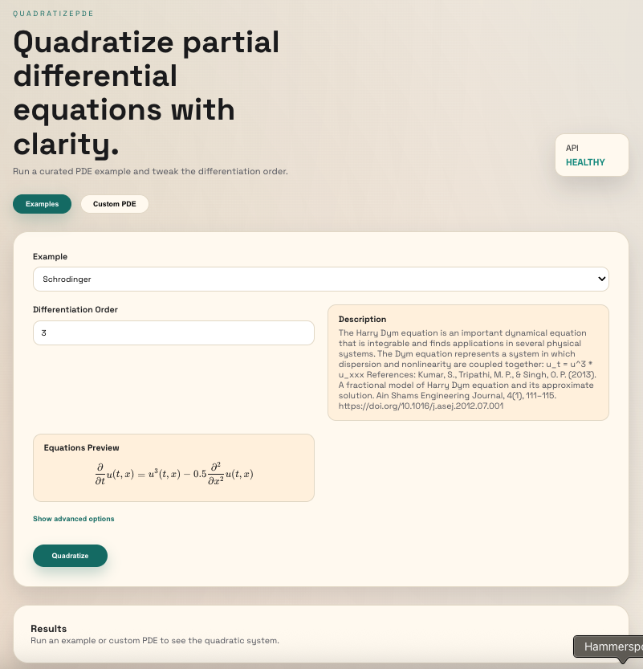
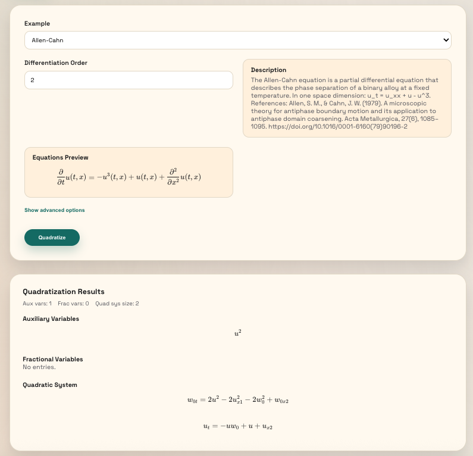
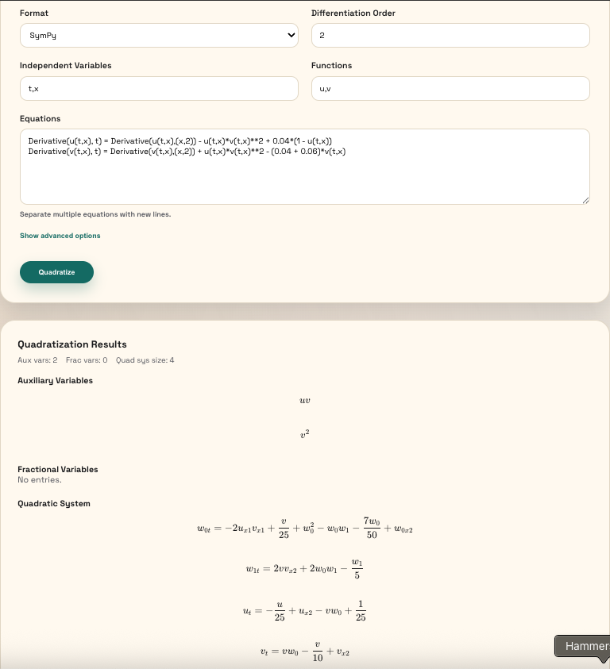

# QuadratizePDE

Web app to quadratize PDEs using the QuPDE library. Includes curated examples, custom PDE input (SymPy/Mathematica syntax), and LaTeX-rendered results.

## Features
- Browse curated examples and run quadratization with one click
- Paste custom PDEs (multiple equations supported)
- Advanced options (search algorithm, sorting, bounds, show traversed nodes)
- KaTeX rendering for previews and results

## Run (Docker)
```bash
docker compose up --build
```

- Frontend: http://localhost:5173
- Backend: http://localhost:8000
- OpenAPI docs: http://localhost:8000/docs

## Run (Local dev)
Backend:
```bash
cd backend
uv run uvicorn app.main:app --reload --port 8000
```

Frontend:
```bash
cd frontend
npm install
npm run dev
```

## API
- `GET /health`
- `GET /api/examples`
- `GET /api/examples/{example_id}`
- `POST /api/quadratize`

## Screenshots
### Examples


### Example run (Allen–Cahn)


### Custom PDE


## License

MIT
